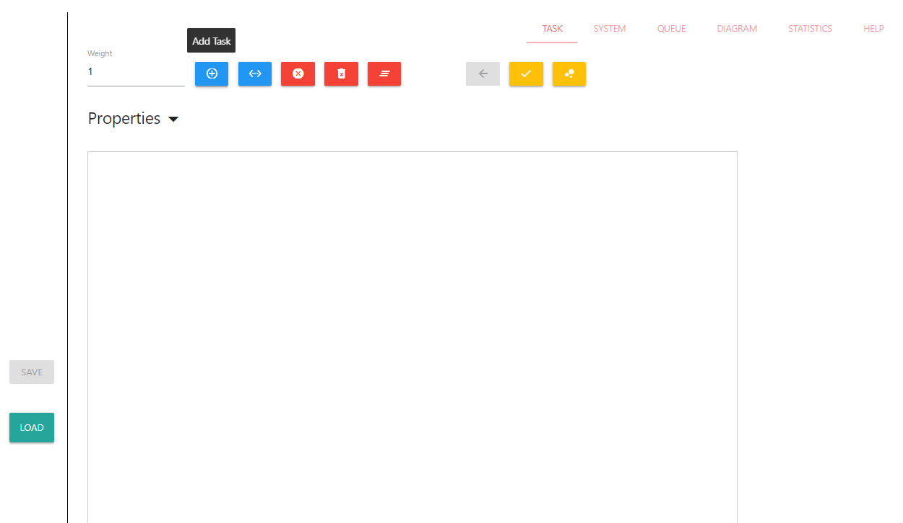

# Computer System Sandbox

This is a sandbox to model graphs of a task and of a computer system, build task queues and simulate their execution on computer system.

## Modeling a task graph
If you start a project you will see the following view:

You may notice a rectangle in the center of the view. This is a canvas used to model a task graph. The buttons are:
- *Add task*: when this button is active, and you click within canvas area, then new subtask vertex will be placed(use `Weight` field to change subtasks' weight);
- *Add relation*: when this button is active - you have to choose 2 subtasks to connect them(use `Weight` field to change relations' weight);
- *Cancel*: deactivates *Add task* or *Add relation* button if any of them was active;
- *Remove Task/Relation*: when this button is active, you can click on any subtask or relation to remove it;
- *Clear*: click this button to clear the canvas;
- *Back*: click this button to cancel last action;
- *Check*: click this button to check whether modelled graph is correct. The task graph is considered correct if it does not have any cycles;
- *Generate*: when you click this button, a popup will be shown. There will be parameters for you to fill in order to generate graph.

Here is an example of a task graph which could be made using canvas and described buttons:

## Modeling a system graph
If you open "SYSTEM" tab, you will see the view which is pretty similar to the task view:

There is another rectangle in the center of the view. This is a canvas used to model a system graph. The buttons are:
- *Add process*: when this button is active, and you click within canvas area, then new processor will be places;
- *Add relation*: when this button is active - you have to choose 2 processors to connect them;
- *Cancel*: deactivates *Add process* or *Add relation* button if any of them was active;
- *Remove Process/Relation*: when this button is active, you can click on any processor or relation to remove it;
- *Clear*: click this button to clear the canvas;
- *Back*: click this button to cancel last action;
- *Check*: click this button to check whether modelled graph is correct. The system graph is considered correct if it is connected(there always is a path between any pair of processors).

Here is an example of a system graph which could be made using canvas and described buttons:

## Queueing subtasks
If you modelled you task graph correct and pressed *Check* button, you will see message saying `Success! The task is correct!`.
After that you will be able to open "QUEUE" tab, and you will see 3 differently formed queues:

The queues use the following algorithms to order tasks:
- *By the difference between late and early deadline(Ascending)*: this algorithm orders subtasks in ascending order of the difference between the late and early execution times of the subtasks of the task graph;
- *By critical path by the vertices to the end(Descending) and connectivity(Descending)*: this algorithm orders subtasks in descending order of the critical paths(by subtasks number) of subtasks to the end of the task graph, and in case of equal values - in descending order of connectivity of the subtasks;
- *By connectivity(Descending) and critical path by the vertices to the begin(Ascending)*: this algorithm orders subtasks in descending order of connectivity of the subtasks, and in case of equal values - in ascending order of the critical paths(by subtasks number) of subtasks to the beginning of the task graph.

## Modelling task execution
You may notice green triangle(like "Play" button) next to each queue. This button is shown only if you designed a system graph and pressed *Check* button to check it. If you click any of the green buttons, you will be redirected to the "Diagram" tab and you will see something like this:

There are some properties you can see in the view:
- *Total task weight*: total sum of all weights of all subtasks;
- *Acceleration coefficient*: the coefficient of acceleration of a given system and given planning algorithm(planning algorithms will be discussed later);
- *Ticks count*: the total amount of ticks which the system made to process a given task;
- *Processors load*: load of processors.

In the center of the view, you can see a long table. It's called Gantt Chart. It represents subtasks execution on processors.
The header defines processors in your modelled system graph and each row represents system's tick. The cells within table are:
- *R[x]*: this item means that processor is executing subtask with number *x*(*R* stands for *running*);
- *W[x]*: this item means that processor is waiting for the data(that is coming from other processors) before starting to execute task *x*(*W* stands for *waiting*).
You may also notice a switch in to top right corner of the view. Using this switch you can switch between different diagram modes: *Execution* and *Data transfer*. *Execution* is a default mode. If you switch to *Data transfer* mode, you will see pretty much similar view:

Here, the cells within table are:
- *R[x-y]{a}*: this item means that processor is receiving the *x*'s subtask task for starting execution of subtask with number *y*. The data is coming from processor number *a*(*R* stands for *receiving*);
- *T[x-y]{a}*: this item means that processor is transferring the *x*'s subtask task for another process to start execution of subtask with number *y*. The data is coming to processor number *a*(*T* stands for *transferring*).

You may also notice 2 radio buttons in the top left corner of the view. Those buttons represent different planning algorithms available in a project. The algorithms are:
- *Free First*: accordingly to this algorithm, when new subtask becomes available, it should be assigned to a processor that is in *idle* state longer than others. This algorithm focuses on balancing of the load on the processors;
- *Neighbor Modeling*: accordingly to this algorithm, when new subtask becomes available, it should be assigned to a processor that requires the least amount of ticks for data transfer. To determine such processor, the algorithm uses a "virtual" modeling to model real-time data transfer and choose the best option.

## Comparing algorithms
And the last tab you can play with is called "Statistics". And it looks like:

After you fill values in the form and click "SHOW STATISTIC" button, the project will generate a lot of task graphs, run them on a system graph you designed on the "SYSTEM" tab, collect all the required data and will generate graphs for you. For example, a graph might look like this:

The horizontal axis represents task graph's connectivity. You can also choose another value *Vertex count* dropdown. Values are formed based on values in fields *Minimum Vertexes Count*, *Maximum Vertexes Count* and *Vertexes Count*. So, for values from example screenshot, dropdown options will be: 8, 16, 24, 32.

You can also choose different options for *Metric* dropdown. The possible options are:
- *Ticks count*: the total amount of ticks needed for an algorithm to complete given task;
- *Acceleration*: represents system's acceleration. It's calculated by dividing task graph's total weight by *Ticks count* value;
- *System efficiency*: represents system's efficiency. It's calculated by dividing *Acceleration* by the number of processors in a designed system;
- *Algorithm efficiency*: represents algorithm's efficiency. It's calculated by dividing theoretical minimum time by *Ticks count*.
